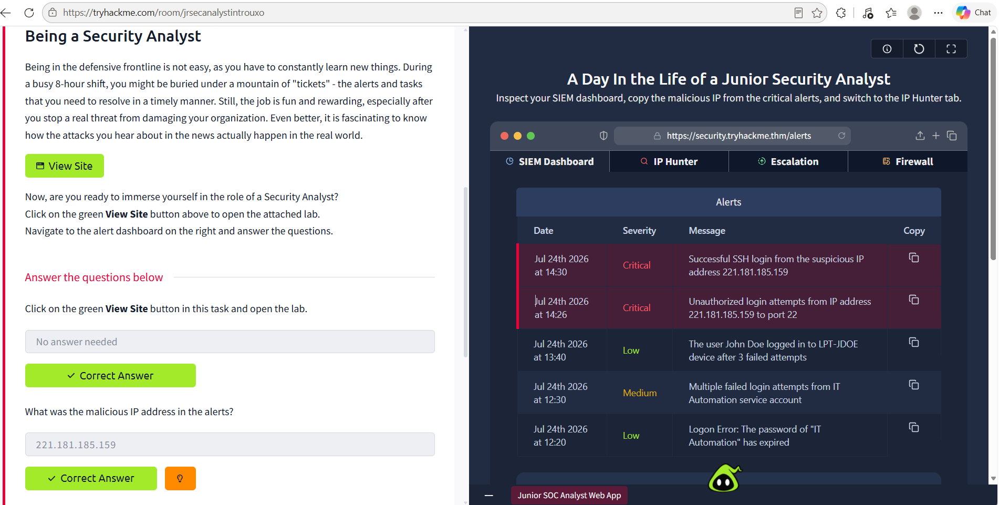
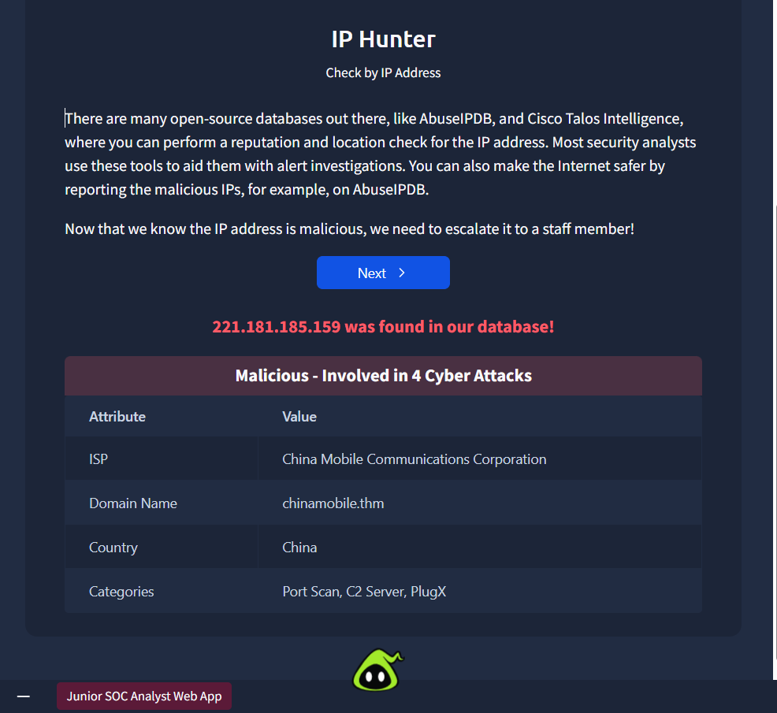
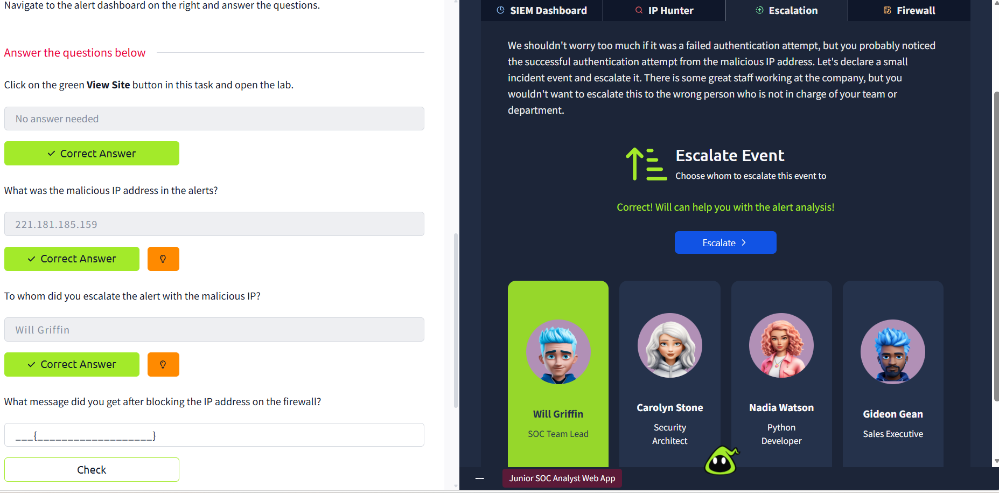
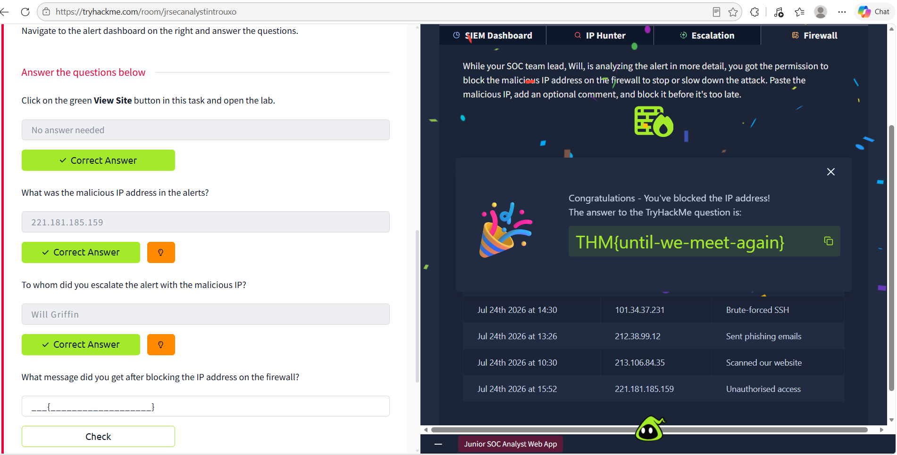
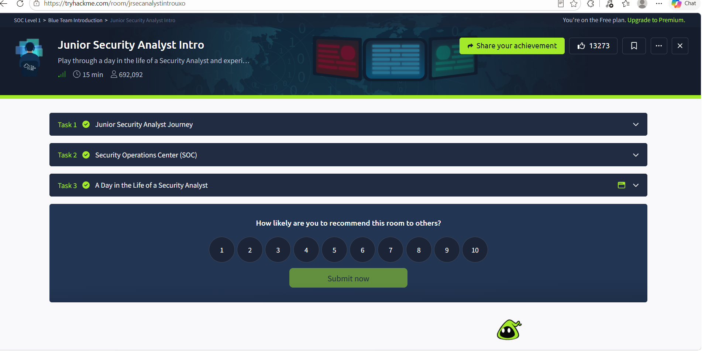

# 🔍 Level 1 SOC Analyst Lab

## 📌 Project Description

This project uses the TryHackMe Junior Security Analyst Intro lab to demonstrate a basic Security Operations Centre (SOC) investigation.

This project demonstrates SIEM alert investigation, detection of malicious activity, analysis of Indicators of Compromise (IoCs), and the SOC incident escalation process.

--- 

# 🚨 Incident Summary

Suspicious authentication activity involving an external IP address trying to access the company's SSH service was discovered by a SIEM warning.

The following malicious IP address was found during the investigation:

**The malicious IP address is:** 221.181.185.159

The activity was associated with unauthorised SSH connection attempts and suspicious login behaviour. 

---

# 🧪 Investigation Procedure 

## 1. Analysis of SIEM Alerts

Examined the security alarms that the SIEM platform produced.

Determined:

- Suspicious SSH authentication activity
- Multiple connection attempts targeting port 22
- Successful authentication attempt from a malicious IP address

---

## 2. Threat Intelligence Analysis

The IP scanner tool was used to investigate the suspicious IP address.

Results:

| Indicator | Details | 
|---|---| 
| IP Address | 221.181.185.159 | 
| Threat Type | Malicious activity | 
| Confidence Score | 100% malicious | 
| Service Targeted | SSH (Port 22) |

---

# 🛠️ Utilised Tools

- The SOC Analyst Lab at TryHackMe
- The SIEM Platform
- IP Reputation scanner
- Security Event longs

---

# 🔎 Key Findings

- Suspicious SSH activity was found
- A malicious external IP address was found
- Verified indicator of compromise (IoC)
- The event was escalated in accordance with SOC protocols

---

# ✅ Response Actions 

Suggested SOC response:

- Block the firewall's malicious IP address
- Keep an eye out for additional compromises on the impacted systems
- Examine the logs of SSH authentication
- Examine potential account compromise
- Implement more robust access controls

---

# 📚 Exhibited Skills

- SIEM alert investigation
- Security log analysis
- Threat intelligence investigation
- Indicator of Compromise (IoC) identification
- Incident escalation process
- SOC analyst workflow

---

# 📸 Evidence

### Task Completion

### SOC Dashboard

